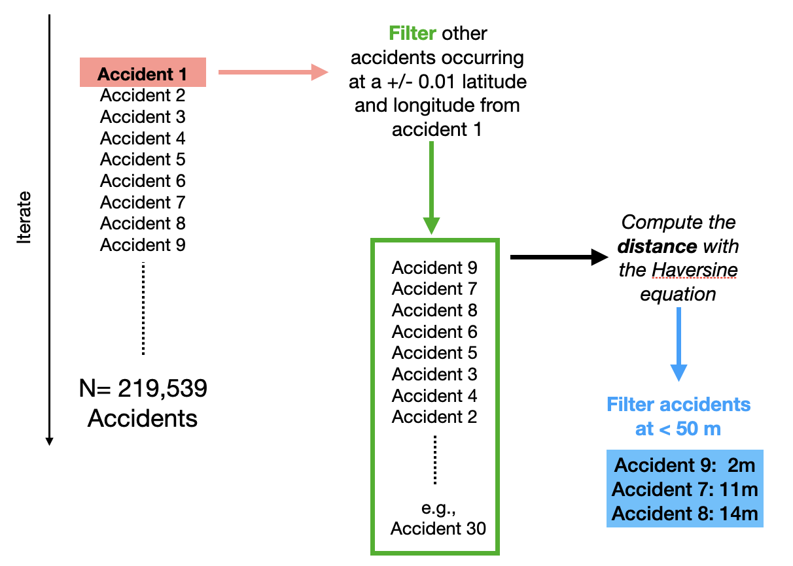

# Identifying dangerous intersections in the United States for conversion into roundabouts 

Ignasi Sols

## **Abstract**

The business impact of this project is to reduce the number of accidents, injuries, and deaths in US intersections. Targeted to the US Congress, the impact hypothesis is that converting dangerous intersections into roundabouts will reduce the number of accidents, injuries, and deaths. The Data Science solution that I provide here is the identification, with a clustering algorithm, of the intersections in the US with at least two accidents between 2016 and 2020, and an interactive dashboard tool in Streamlit Sharing, to visualize my results. The scientific evidence supporting the conversion of intersections is a 2017 **meta-analysis of 44 different studies showing a 65% decrease in fatal accidents when converting junctions into roundabouts** (https://pubmed.ncbi.nlm.nih.gov/28064101/=100x20). 

## **Design**

I have chosen two datasets. The first is a comprehensive dataset of accidents in the US between 2016 and 2020 (https://www.kaggle.com/sobhanmoosavi/us-accidents). This dataset is updated yearly and its main accident data (accident location, description, time, severity) is extracted from real-time traffic Data from “MapQuest Traffic" and “Microsoft Bing Map Traffic”. The accident 'severity' score for each accident was not referring to the incident per se (how many injured and fatalities), but to how much the traffic was affected. Moreover, the severity scores from “MapQuest Traffic" and “Microsoft Bing Map Traffic” are not exactly the same.  It seems there is no clear way to do a 1:1 mapping between severity reported by Bing versus MapQuest. For these reasons, for this dataset, I did not consider the severity score. The second dataset is data from the Department of Transportation itself: all US accidents with at least one fatality, between 2016 and 2019 (therefore, unlike the first dataset, there is no data for 2020).

## **Data**

The first dataset includes 1,516,064 accidents (one per row) and 45 columns. A latitude and longitude coordinates for the point where the accident occurred are included in the dataset ('start lat','start lon'). Also, different generic points of interest (e.g., crossing, traffic signal, stop sign) relevant to the accident are reported for each accident. For example, if an accident occurred close enough to a traffic signal, its value on the 'traffic signal' column will be 'True'. I first checked the location on Google Maps of a few accidents on 'junctions', and they did not seem to occur on intersections. Thus, I checked the paper in which the authors of the dataset present their work to the scientific community to understand what do they mean by 'junction'. Their definition of junction refers to "any highway ramp, exit, or entrance". The 'junction' definition on the meta-analysis seems to be different, basically referring to three or four-legged intersections, as written in a previous meta-analysis by the same author (https://journals.sagepub.com/doi/abs/10.3141/1847-01?casa_token=HrxOz3FKTnoAAAAA:JB02tx2xWLRPTS7fOrUdTin3wgvFwizDtKyMEYbHXIrWP4Z3LOnaVFwu0_OoF4wstXGJC9oxiWI)

After checking on Google Maps several accidents that occurred near 'Traffic signals', it became obvious that 'Traffic signals' were referring to intersections. Therefore, for this project, I have not considered  'Junctions'. I have included accidents that occurred close to a traffic signal, stop sign or pedestrian crossing. In future iterations of this project, I might drop the pedestrian crossings as they might refer to street intersections within cities, which might be more difficult to convert into roundabouts. 
The second dataset included only information about deadly accidents, and if the accident happened or not near an intersection. I combined both datasets, but for this project, I did not check if accidents that appear in both datasets might or might not be the same. Duplicates were removed for the Kaggle dataset. The final merged dataset had 219,539 accidents. 

## **Algorithm**

Next, I  applied a custom algorithm that clusters accidents that occurred in the same intersection. 

First, for each of the 219,539 accidents, I have narrowed down the accidents to compare with. To reduce computational complexity, for each accident, only accidents occurring in a +/- 0.01 latitude, and +/- 0.01 longitude were considered (~1000-1200m). Then, I applied the Haversine equation to compute the distance in meters between each accident's location and the selected accident locations. For each accident, I stored all the accident IDs that occurred at fewer than 50 meters. 50 meters is a threshold chosen arbitrarily, and this distance parameter could be tuned in future work. All accidents that did not meet the criteria of occurring at least 50 away from another accident were removed from the data frame. 

Next, I proceed to identify specific intersections. For each accident, I included their ID number on its specific list of accidents that occurred at less than 50 meters. For instance, if accident number 11 happened close to accidents [12, 14, 21], I updated the list to be now [**1** 12,14,21]. Then, the lists are converted to sets, and then, the algorithm counts unique sets. For instance, the set  [**1**12,14,21] might have appeared repeated **four times** if each of the accidents of the set occurred 50 meters from each other. But imagine that there was another accident happening close to this cluster, but not close enough to all the other accidents. We could have accident 100 happening less than 50 meters away from accident 14, but more than 50 meters away from the other accidents [11, 12, 21]. The set would be [14  **100**], and this set can only be repeated **2 times**. What the algorithm does next is that it drops the set with fewer repetitions and only keeps the one with more repetitions, the assumption being that the unique set with more repetitions is more likely to be the accident cluster core. 

After inspecting numerous intersection locations on Google Maps, I decided to drop one intersection that had the most accident counts (46). All the accidents were reported on the same spot, above a highway. A careful check of the accident descriptions showed that the accidents were referring to the highway below, where no intersection or traffic signal was reported. Moreover, the description was quite unspecific of the particular place where it happen on the highway. After dropping this cluster, the clustering analysis ended with **31,445 intersections**  in total.

## **Tools**

* Google Colab. 
* Numpy and pandas for implementing the clustering algorithm.
* Plotly for map visualization. I used OpenStreetMap for the detailed US map used for visualization.
* Streamlit for web app design and hosting.

## Communication

I generated a web app with Streamlit, available on Streamlit sharing. This web app allows the user to visualize all intersections (including those that had no fatalities reported). In this case, the map provides fatality ratio information as well as the overall number of accidents in each intersection. The user can also choose to view a map with only intersections that had fatalities.

https://share.streamlit.io/ignasisols/metis_dataengineering_project/main

